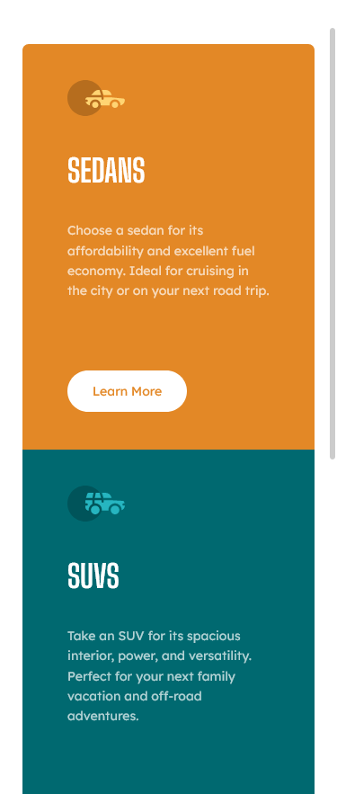
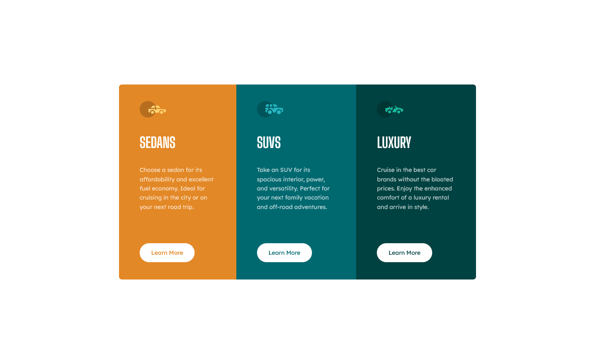
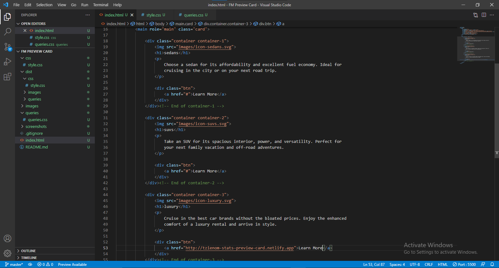
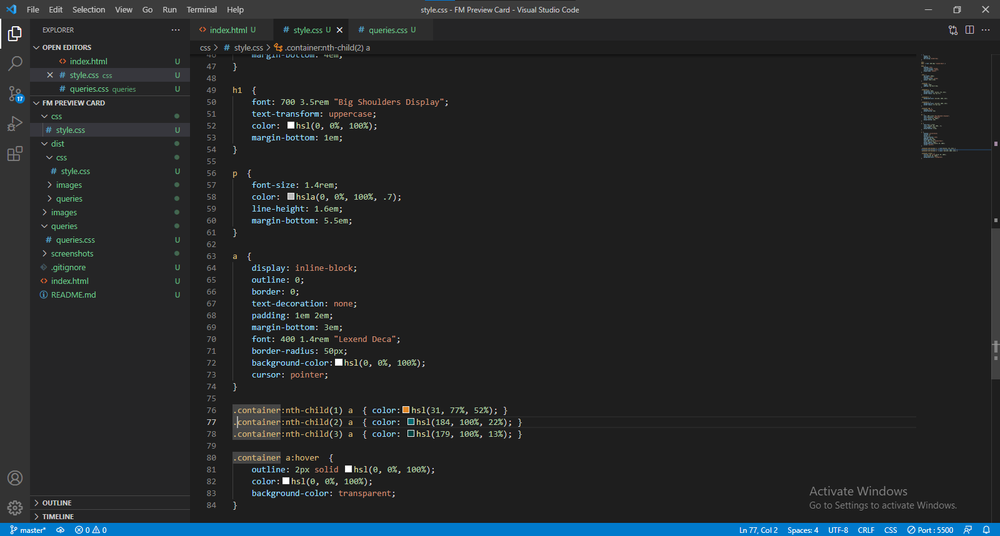
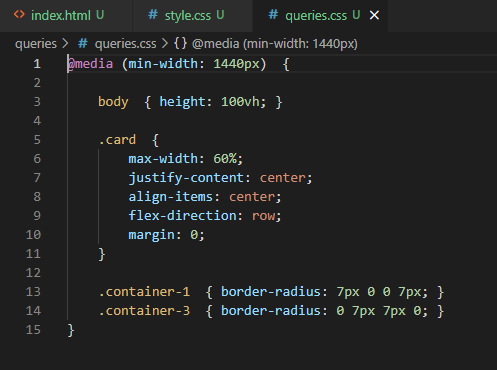

# Frontend Mentor - 3-column preview card component solution

This is a solution to the [3-column preview card component challenge on Frontend Mentor](https://www.frontendmentor.io/challenges/3column-preview-card-component-pH92eAR2-). Frontend Mentor challenges help you improve your coding skills by building realistic projects. 

## Table of Contents

- [Overview](#overview)
  - [The challenge](#the-challenge)
  - [Screenshot](#screenshot)
  - [Links](#links)
- [My process](#my-process)
  - [Built with](#built-with)
  - [Continued development](#continued-development)
- [Author](#author)

### The Challenge

To build the 3-column preview card component and get it looking as close to the original design as possible.

Users should be able to:

- View the optimal layout depending on their device's screen size
- See hover states for interactive elements

### Screenshot

### Links

## My Process

### Built with

- HTML5 Semantic markup
- Flexbox
- Mobile-first workflow

### Continued development

- Responsive Layout
- FlexBox

# Author

- Frontend Mentor - [@Tzienom](https://www.frontendmentor.io/profile/Tzienom)